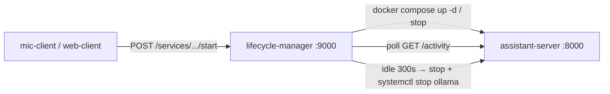

# Server Lifecycle Manager

**Part of the [Local AI Assistant](https://github.com/mattdwall100/local-assistant-server) system.**
Start there for the architecture and the full voice pipeline.

**Entirely manually coded — without AI coding agents.**

A small FastAPI control-plane service that starts, stops, monitors, and idles down the assistant
server's Docker Compose workload. **This is what makes a heavyweight local LLM stack practical on a
single machine:** the assistant server (which pins a multi-GB model in memory via Ollama) sleeps
when idle and wakes on demand, instead of holding RAM 24/7.

Clients ask this manager to start the server, then talk to the server directly. The manager polls
the server's `/activity` endpoint and, after an idle timeout, stops the container **and unloads
the Ollama model** to free memory.



## What It Does

- Exposes an HTTP API for listing configured services and starting/stopping them.
- Tracks service lifecycle state: `on`, `off`, `starting`, and `stopping`.
- Uses Docker CLI / Docker Compose to control configured backend services.
- Polls managed services for activity timestamps and shuts them down after an idle timeout.
- Runs background monitoring loops during the FastAPI application lifespan.
- Loads service definitions from YAML and runtime settings from environment variables.
- Supports local AI infrastructure workflows, including cleanup hooks such as stopping `ollama`.

## System Context

The lifecycle manager is one part of a local AI assistant setup:

- Client apps interact with the assistant-facing API/server.
- The assistant server runs as a Docker Compose service.
- This lifecycle manager starts, stops, monitors, and idles the assistant server.
- The assistant server exposes an activity endpoint used by this service to decide whether it is still in use.

## API Surface

| Method | Route | Purpose |
| --- | --- | --- |
| `GET` | `/services` | List configured services |
| `GET` | `/services/{name}/status` | Return lifecycle status |
| `GET` | `/services/{name}/activity` | Return seconds until idle shutdown |
| `POST` | `/services/{name}/start` | Start a service |
| `POST` | `/services/{name}/stop` | Stop a service |

FastAPI also provides generated OpenAPI documentation at `/docs`.

## Status & known gaps

Honest about where this sits — it's a working control plane with real edges to file down:

- **No tests yet.** `tests/test_health.py` is an empty placeholder. The `pytest`/`pytest-cov`
  tooling below is configured and ready, but no cases are written. The monitor loops and the
  Docker-state → lifecycle-status mapping are the priorities to cover first.
- **The API is unauthenticated.** A `SERVER_MANAGER_TOKEN` env var exists but is not yet enforced
  on requests, so anything that can reach port 9000 can start/stop services. Fine on a trusted LAN;
  a token check is needed before exposing it more widely.
- `deployment/systemd/server-manager.service` is currently an empty stub.

## Tools and Technologies

- Python 3.11+
- FastAPI
- Uvicorn
- Pydantic v2
- pydantic-settings
- asyncio
- Docker
- Docker Compose
- PyYAML
- requests
- pytest / pytest-cov
- Ruff
- mypy

## Engineering Practices Demonstrated

- Modular backend structure with separate API, runtime, orchestration, monitoring, configuration, state, schema, and logging layers.
- Typed request/response models and configuration models using Pydantic.
- Environment-driven configuration with `.env` support.
- YAML-based service registry for externally managed services.
- Async orchestration around blocking Docker and HTTP operations.
- FastAPI lifespan hooks for startup synchronization and shutdown cleanup.
- Background task management with explicit cancellation.
- Dockerized deployment path with Docker CLI access inside the service container.
- Host/container networking awareness through Docker socket mounting and `host.docker.internal`.
- Centralized logging and custom exception types for service/runtime errors.
- Static analysis and test tooling configured through `pyproject.toml`.

## Repository Structure

```text
server-lifecycle-manager/
+-- config/
|   +-- services.yaml
+-- deployment/
|   +-- systemd/
|       +-- server-manager.service
+-- src/
|   +-- server_manager/
|       +-- __init__.py
|       +-- api.py
|       +-- config.py
|       +-- logging.py
|       +-- main.py
|       +-- monitor.py
|       +-- orchestrator.py
|       +-- runtime.py
|       +-- schemas.py
|       +-- state.py
+-- tests/
|   +-- test_health.py
+-- .dockerignore
+-- .gitignore
+-- Dockerfile
+-- docker-compose.yml
+-- pyproject.toml
+-- README.md
+-- requirements-dev.txt
+-- requirements.txt
```

## Key Files

- `src/server_manager/api.py`: FastAPI routes and API-level error handling.
- `src/server_manager/main.py`: application factory, dependency wiring, and lifespan management.
- `src/server_manager/orchestrator.py`: coordinates runtime operations, service state, and config lookup.
- `src/server_manager/runtime.py`: Docker Compose, Docker inspect, subprocess, and activity endpoint integration.
- `src/server_manager/monitor.py`: async background loops for idle shutdown and pending status checks.
- `src/server_manager/state.py`: in-memory service state and idle-time calculation.
- `src/server_manager/config.py`: environment settings and YAML service registry.
- `config/services.yaml`: configured assistant server service, URLs, timeout, and cleanup commands.
- `Dockerfile`: container image with Python runtime and Docker CLI tooling.
- `docker-compose.yml`: local deployment including Docker socket and service-directory mounts.

## Running Locally

Install dependencies:

```bash
pip install -r requirements-dev.txt
```

Run the API:

```bash
python -m src.server_manager.main
```

Or run with Docker Compose:

```bash
docker compose up --build
```

The service listens on port `9000` by default.

## Quality Commands

```bash
python -m pytest
python -m ruff check .
python -m mypy src
```
